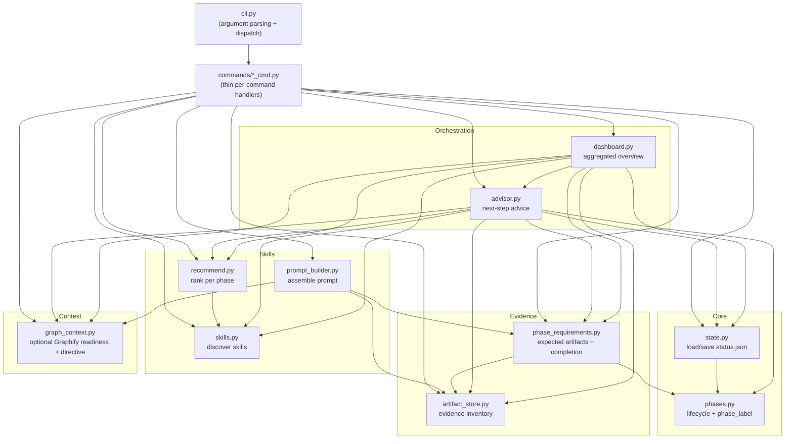

# Architecture

ProjectPilot is a set of small, single-responsibility modules. The CLI parses arguments and
dispatches to a thin command module per command; all logic lives in the subsystems below. Each
subsystem exposes a clear public API, and higher layers consume those APIs rather than reaching into
another module's internals.

Everything is **deterministic** and **stdlib-only**: no LLM calls, no network, no process spawning,
and no runtime dependencies. A static test (`tests/test_no_automation.py`) fails the build if `src/`
ever references process spawning, networking, the GitHub API, or release/install automation.

## Module map

(If your viewer does not render Mermaid, read the arrows as "depends on / consumes the public API of".)

## Subsystems and public APIs

| Subsystem | Module | Responsibility | Key public API |
| --- | --- | --- | --- |
| Lifecycle | `phases.py` | Canonical phases, ordering, display labels | `Phase`, `PHASE_ORDER`, `next_phase`, `phase_label`, `gate_for_next` |
| State | `state.py` | Load/save `.project-pilot/status.json` | `ProjectState`, `load_state`, `save_state`, `state_exists` |
| Config | `config.py` | Read `.project-pilot/config.yaml` (YAML subset) | `load_config`, `load_mapping`, `EXTERNAL_SKILL_PATHS_KEY` |
| Skills (scanner) | `skills.py` | Discover external skills | `scan_skills`, `find_skill`, `render_skill`, `skill_body`, `resolve_sources` |
| Recommendations | `recommend.py` | Rank skills for a phase | `rank`, `keywords_for_phase`, `stars_string` |
| Prompt builder | `prompt_builder.py` | Assemble an agent-ready prompt | `collect_context`, `build_prompt` |
| Artifact store | `artifact_store.py` | Evidence inventory (metadata only) | `add_artifact`, `list_artifacts`, `find_artifact`, `remove_artifact`, `sha256_file` |
| Phase requirements | `phase_requirements.py` | Which artifacts a phase expects; completion | `evaluate`, `requirements_for`, `REQUIREMENTS` |
| Workflow advisor | `advisor.py` | Suggest the next step | `advise` |
| Dashboard | `dashboard.py` | Aggregate the above into one view | `collect` |
| Graph context | `graph_context.py` | Inspect optional Graphify outputs; render compact query guidance | `GraphContextStatus`, `inspect_graph_context`, `render_query_directive` |
| Console | `console.py` | Terminal-output capability | `glyphs`, `encodable`, `make_output_resilient` |

## Design principles

- **Single source of truth.** `phases.phase_label` is the only place a phase display name is derived;
  `phase_requirements.evaluate` is the only place phase completeness is computed (the advisor, prompt
  builder, and dashboard all consult it).
- **No internal reach-through.** Modules call each other's public functions only.
- **Aggregators add no logic.** `dashboard.py` composes other subsystems' public outputs; it contains
  no workflow rules of its own.
- **Metadata, never contents.** The artifact store and everything downstream read only artifact
  metadata (path, size, SHA-256, type, phase) — never the file contents.
- **External context stays advisory.** ProjectPilot checks only configuration, safe path containment,
  output-file presence, and ordinary file metadata. It never reads or parses the contents of
  `graph.json` or `GRAPH_REPORT.md`, and never imports, executes, or updates Graphify.
- **Deterministic output.** Given the same recorded state, text and `--json` output are byte-identical,
  so JSON is safe to consume from other tools.

See also: [workflow.md](workflow.md) for the lifecycle and per-phase commands, and
[extending.md](extending.md) for the supported extension points.
