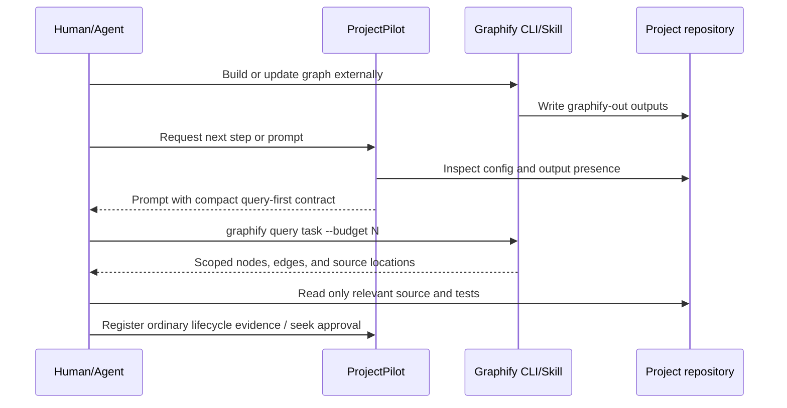

# Graphify integration for ProjectPilot

**Status:** Approved, implemented, and reviewed
**Date:** 2026-07-15
**Target:** ProjectPilot v1.x
**Decision:** Add an opt-in, advisory-only Graphify context integration. Graphify remains an external tool; ProjectPilot detects its outputs and steers agents to query them before opening source files.

## 1. Context

ProjectPilot is a deterministic, standard-library-only lifecycle orchestrator. It records state, prepares prompts, recommends next steps, and enforces human approval gates. Its runtime does not spawn processes, call networks or LLMs, install tools, or execute technical work.

Graphify builds a persistent knowledge graph from a project and exposes scoped `query`, `path`, and `explain` operations. Its main value to ProjectPilot is context retrieval: an agent can retrieve a small subgraph and a short list of source locations instead of repeatedly searching and loading a large repository.

The integration therefore belongs at the boundary between orchestration and execution:

- ProjectPilot decides when graph-backed context would be useful and prepares concise instructions.
- Graphify performs extraction and queries outside the ProjectPilot runtime.
- The agent verifies critical facts in source code and runs the normal project checks.

## 2. Goals

1. Reduce input tokens consumed by agents during planning, execution, and final validation.
2. Make graph-first retrieval consistent across sessions instead of depending on agent memory.
3. Preserve ProjectPilot's charter: deterministic, standard-library-only, no process spawning, no network, no LLM calls, and no self-execution.
4. Keep Graphify optional. Projects without Graphify must behave exactly as they do today.
5. Treat the graph as a retrieval index, not an authoritative replacement for source code or tests.
6. Measure actual agent token usage before claiming a product-level saving.

## 3. Non-goals

- Importing Graphify or NetworkX into ProjectPilot.
- Starting a Graphify CLI or MCP server from ProjectPilot.
- Installing or upgrading Graphify from ProjectPilot.
- Automatically rebuilding graphs, adding Git hooks, or watching the filesystem.
- Automatically registering Graphify outputs as lifecycle evidence.
- Making a knowledge graph mandatory for any lifecycle phase.
- Replacing `rg`, targeted source reads, tests, or human review.
- Supporting multiple context providers in the first increment.

## 4. Options considered

### 4.1 Documentation-only integration

Document a manual Graphify workflow and let users add instructions to their agent configuration.

**Advantages:** no ProjectPilot code change; immediate experiment.
**Disadvantages:** inconsistent adoption; agents can forget the graph; dashboard and advisor cannot explain readiness.

### 4.2 Native advisory integration — selected

ProjectPilot detects Graphify output files and adds a short, deterministic query-first directive to relevant prompts. The advisor and dashboard expose readiness, while all Graphify execution remains external.

**Advantages:** reliable token-saving behaviour; preserves the charter; small, testable change; no new runtime dependency.
**Disadvantages:** introduces one named ecosystem integration and requires clear stale-graph handling.

### 4.3 Embedded library or MCP integration

Import Graphify, invoke its Python API, spawn the CLI, or connect to its MCP server from ProjectPilot.

**Advantages:** deepest automation and direct query results.
**Disadvantages:** breaks zero-dependency and no-execution guarantees; weakens determinism; expands security and operational surface; conflates orchestration with execution.

## 5. Product decision

Implement option 4.2 in two stages:

1. Add the advisory integration behind explicit project configuration.
2. Run an A/B pilot and retain the feature only if actual agent telemetry shows a worthwhile saving without a quality regression.

Do not pass Graphify's full installed `SKILL.md` through `pp skill use`. The Graphify skill contains extensive operational instructions; copying it into every ProjectPilot prompt would add substantial context before any graph query. ProjectPilot will inject only a small retrieval contract. The agent-native Graphify skill remains available for progressive disclosure when detailed operating instructions are required.

## 6. Configuration

Use top-level scalar keys compatible with ProjectPilot's existing tolerant configuration parser:

```yaml
graphify_enabled: true
graphify_output_dir: graphify-out
graphify_query_budget: 1200
```

Rules:

- `graphify_enabled` defaults to `false`.
- `graphify_output_dir` defaults to `graphify-out` and must resolve inside the project root.
- `graphify_query_budget` defaults to `1200` and accepts an integer from `250` through `5000`.
- Invalid values degrade to defaults and produce deterministic diagnostic text in `pp doctor`; they do not break ordinary commands.
- Configuration enables ProjectPilot guidance only. It never implies permission to execute or install Graphify.

Explicit opt-in avoids changing existing project output and gives teams control over whether Graphify is part of their workflow.

## 7. Architecture

Add one focused module, `graph_context.py`, with no Graphify import:

```text
config.yaml
    |
    v
graph_context.py ----> ContextStatus
    |                     | ready / partial / missing / disabled
    |                     | graph and report relative paths
    |                     | validated query budget
    |
    +--> advisor.py -------- optional build/update recommendation
    +--> prompt_builder.py - compact query-first contract
    +--> dashboard.py ------ additive readiness view
    +--> doctor_cmd.py ----- environment/config diagnostics
```

The module exposes small public functions:

```python
@dataclass(frozen=True)
class GraphContextStatus:
    enabled: bool
    state: str
    graph_path: str
    report_path: str
    query_budget: int
    diagnostics: tuple[str, ...] = ()
    output_path_usable: bool = True

def inspect_graph_context(base: Path) -> GraphContextStatus: ...
def render_query_directive(status: GraphContextStatus, skill_name: str) -> str: ...
```

These names and signatures are the implementation contract. Additional private helpers are allowed, but the public boundary remains pure inspection and deterministic text rendering only.

`output_path_usable` is the structural safety signal for downstream consumers.
Inspection sets it to `false` for the normal disabled short-circuit and whenever
no contained output directory can be resolved or either expected output entry
is unsafe or uninspectable. It is `true` only after directory containment
succeeds and each entry is either genuinely absent or a safe present regular
file. The field is final and defaulted so legacy positional and keyword
construction remains compatible. It is intentionally absent from the dashboard
JSON object, whose public schema remains unchanged.

Output entry inspection uses a private tri-state: safe present, absent, or
unsafe. Only safe-present entries count toward `partial` and `ready`; an absent
entry keeps the destination usable for a suggested build, while a reparse or
symbolic link, non-regular entry, containment escape, or metadata failure makes
the destination unusable. This internal distinction does not expand the public
API.

### 7.1 Readiness states

- `disabled`: configuration is absent or false.
- `missing`: enabled, but neither required output is safely present.
- `partial`: exactly one of `graph.json` or `GRAPH_REPORT.md` is safely present.
- `ready`: both required outputs are safe regular files inside the configured output directory.

ProjectPilot checks only existence, path containment, and ordinary file metadata. It does not parse `graph.json`, interpret Graphify's graph schema, or decide that the graph is fresh. Graphify remains responsible for graph validation and updates.

## 8. Behaviour by subsystem

### 8.1 Prompt builder

When Graphify is enabled and ready, prompts for planning, execution, and final validation receive this compact contract, populated deterministically from the selected skill and configured budget. The query question is `What project context is relevant to <skill_name>?`. To form it, ProjectPilot retains only Unicode alphanumerics, whitespace, and the minimal punctuation allowlist `- _ . / '`, replaces every other character with a space, and then collapses whitespace. An empty normalized name still falls back to `the selected skill`, and the complete question remains capped at 300 characters before rendering:

```text
## Context retrieval

An existing Graphify index is available. Query it before broad file search:
`graphify query "What project context is relevant to Create PRD?" --budget 1200`

Use returned source locations to open only the files needed for this task.
Treat INFERRED or AMBIGUOUS edges as hypotheses. Verify critical behaviour in
source and tests before making or approving a change.
```

Constraints:

- The inserted section stays under 100 words excluding the task text.
- It contains no installation instructions and executes nothing.
- It is omitted when disabled, missing, or partial.
- The selected skill name is safely rendered for display; ProjectPilot does not pass it to a shell.
- The same state and selected skill produce byte-identical output.

### 8.2 Advisor

Add one rule after required phase evidence and before low-priority convenience advice:

- In `planning`, `execution`, or `final-validation`, when enabled, `missing` or `partial`, and `output_path_usable` is true, return a **Medium** recommendation to prepare or repair the external knowledge graph.
- The recommendation explains that ProjectPilot will not run the command.
- The suggested build command is `graphify . --no-viz`, displayed as operator guidance. It contains no installation, network, or release action.
- When `output_path_usable` is false, return one **Medium**, commandless recommendation to repair the Graphify output configuration. Never suggest a build command that could write through a rejected path.
- When ready, the rule returns no recommendation; prompt injection supplies the query-first behaviour.

Graph preparation remains optional and must never block a gate or reduce phase completion.

### 8.3 Dashboard

Add a compact section to text output when Graphify is enabled:

```text
Knowledge context
Provider: Graphify
Status: Ready
Query budget: 1200 tokens
```

Add an additive JSON object without changing existing keys:

```json
"context": {
  "provider": "graphify",
  "status": "ready",
  "query_budget": 1200,
  "graph": "graphify-out/graph.json",
  "report": "graphify-out/GRAPH_REPORT.md"
}
```

When disabled, omit both the text section and the JSON object. This preserves byte-identical output for non-participating projects and is locked with compatibility tests.

### 8.4 Doctor

`pp doctor` uses `shutil.which("graphify")` to report whether the external executable is discoverable on `PATH`. It does not search project-local executable locations, run the executable, or inspect its version.

Diagnostics distinguish:

- feature disabled;
- feature enabled but command unavailable;
- command available but outputs missing;
- partial outputs;
- ready outputs;
- invalid configuration using defaults.

Runtime messages point to ProjectPilot documentation for installation guidance. Installation commands remain in documentation, not executable ProjectPilot logic.

### 8.5 Artifact store and phase requirements

ProjectPilot does not automatically register `graph.json` or `GRAPH_REPORT.md`.

Users may register them manually with `pp artifact add`, but graph outputs do not satisfy PRD, roadmap, brief, risk, or approval requirements unless an existing requirement's explicit matching rules say otherwise. The integration adds no mandatory requirement and no automatic phase advancement.

## 9. External operating flow

The human or agent performs Graphify actions outside ProjectPilot:

1. Enable the integration in `.project-pilot/config.yaml`.
2. Install Graphify separately according to Graphify's own documentation.
3. Build the initial graph from the project root. Code-only AST extraction is preferred for the first pilot because it has no LLM-token ingest cost; semantic extraction of documents is optional.
4. Run `pp doctor` and confirm the context state is ready.
5. Generate a ProjectPilot prompt. The prompt directs the agent to issue a budgeted graph query first.
6. The agent opens only the source locations needed to verify and complete the task.
7. After meaningful code changes, the agent or human updates Graphify externally before relying on it in a later session.

ProjectPilot neither assumes nor records that an external command succeeded. Readiness changes only when expected output files are present.

## 10. Data flow



## 11. Freshness and source-of-truth policy

The highest integration risk is a stale or incomplete graph. ProjectPilot cannot guarantee freshness without executing or deeply understanding Graphify, so the contract is explicit:

- A ready state means outputs are present, not current.
- Prompts tell agents to update externally when significant changes occurred since the last graph build.
- Graph facts guide retrieval; source code, tests, and recorded human approvals remain authoritative.
- `EXTRACTED` edges are stronger retrieval evidence than `INFERRED` or `AMBIGUOUS` edges, but even extracted relationships must be verified before consequential changes.
- A failed or empty graph query falls back to targeted `rg` and source reads. It never blocks work.

A later increment may support a deterministic freshness hint derived from Graphify's manifest, but only after its format is treated as a stable external contract. That is outside this design.

## 12. Error handling

- **Missing executable:** `pp doctor` reports it; normal ProjectPilot commands continue.
- **Missing outputs:** advisor recommends external preparation; prompts omit the query directive.
- **Partial outputs:** treat as not ready and recommend repair/rebuild.
- **Configured path escapes project root:** ignore the unsafe value, use the default inside the project, and report a diagnostic.
- **Invalid query budget:** use 1200 and report a diagnostic.
- **Corrupted graph:** ProjectPilot does not parse it. Graphify reports the query/build error; the agent falls back to ordinary retrieval.
- **Query returns no matches:** use targeted search and record this case in pilot metrics.
- **Graphify unavailable after a prompt was created:** the agent follows the documented fallback; no ProjectPilot state is corrupted.

## 13. Security and privacy

- ProjectPilot stores no Graphify credentials and reads no API keys.
- ProjectPilot opens no network connection and starts no process.
- Paths are resolved and constrained to the project root before being reported.
- Graphify's local AST extraction is the default pilot path.
- Semantic extraction of documents or media may use an externally configured model and must remain an explicit operator choice governed by Graphify's privacy model.
- Generated graph files may expose project structure and symbols. They follow the repository's existing sensitivity and version-control policy; ProjectPilot does not add them to Git automatically.

## 14. Testing strategy

All tests use `unittest` and temporary directories.

### 14.1 Unit tests

- Configuration defaults, valid values, invalid booleans, invalid budgets, and path containment.
- Readiness detection for disabled, missing, partial, and ready states.
- Query directive exact text, safe task rendering, budget boundaries, and deterministic output.
- Phase filtering: no directive outside planning, execution, or final validation.
- Advisor rule presence, priority, order, and non-blocking behaviour.
- Dashboard text and additive JSON shapes.
- Doctor diagnostics without executing an external command.

### 14.2 Integration and regression tests

- Existing projects with no Graphify configuration produce byte-identical text and JSON.
- `tests/test_no_automation.py` remains unchanged and green.
- Full test suite passes on Python 3.12 and, when practical, 3.13.
- No new runtime dependency appears in `pyproject.toml`.
- No Graphify output is automatically written, modified, registered, or deleted.
- No gate or phase completion changes because Graphify is enabled.

## 15. Pilot and success criteria

Run an A/B pilot before presenting token reduction as a ProjectPilot feature claim.

### 15.1 Sample

- Three repositories: one small, one medium, and one large.
- At least five representative tasks per repository.
- Include architecture explanation, change-impact analysis, targeted bug diagnosis, implementation planning, and final review.
- Run the same model, reasoning level, task text, and tool permissions in both variants.

### 15.2 Variants

- **A — baseline:** current ProjectPilot prompt and ordinary repository tools.
- **B — Graphify:** proposed compact directive, graph query budget 1200, then targeted source verification.

### 15.3 Metrics

- Actual model input tokens from the agent/tool usage ledger.
- Output tokens.
- Task success or independently graded key-fact coverage.
- Number of files opened and broad searches executed.
- Wall-clock duration.
- Graph query failures and stale-graph incidents.
- One-time graph build cost and number of queries required to amortize it.

### 15.4 Acceptance threshold

Proceed to normal availability when the pilot shows:

- at least 30% median reduction in input tokens across all tasks;
- no correctness or task-completion regression;
- no severe stale-graph failure;
- no ProjectPilot charter regression;
- acceptable build/update latency for repeated use.

Results must be reported by repository size. A weak result on small repositories is acceptable if medium and large repositories show a clear benefit and the feature remains opt-in.

## 16. Rollout

1. **Experimental:** implement opt-in detection, prompt directive, advisor, dashboard, doctor, tests, and documentation.
2. **Pilot:** run the A/B matrix and publish raw measurements internally.
3. **Review:** tune the default query budget or disable underperforming phases based on evidence.
4. **Stable optional feature:** document measured savings with repository-size caveats.
5. **Deferred evaluation:** only then consider automatic output detection or a generic context-provider abstraction. Embedded execution remains out of scope unless ProjectPilot's charter is deliberately revised.

## 17. Documentation changes

- Add a README section describing Graphify as an optional context-retrieval integration.
- Add a focused `docs/graphify-integration.md` with separate installation, build/update, privacy, and troubleshooting guidance.
- Update `docs/architecture.md` with `graph_context.py` and its consumers.
- Update `docs/extending.md` to explain why the integration is advisory-only.
- Add a `[Unreleased]` changelog entry.
- Keep all ecosystem language example-framed; ProjectPilot remains usable without Graphify.

## 18. Fixed implementation constraints

The implementation plan must preserve these resolved choices:

1. The module is `graph_context.py`; its public type and functions are `GraphContextStatus`, `inspect_graph_context`, and `render_query_directive`.
2. Disabled context is omitted from both dashboard text and JSON.
3. The advisor's external build guidance is exactly `graphify . --no-viz`.
4. The prompt query is derived from the selected skill name as specified in section 8.1.
5. `pp doctor` checks `PATH` only through `shutil.which("graphify")`.

No implementation detail may authorize ProjectPilot to execute Graphify, add a runtime dependency, block a lifecycle gate, or treat graph output as authoritative evidence.
